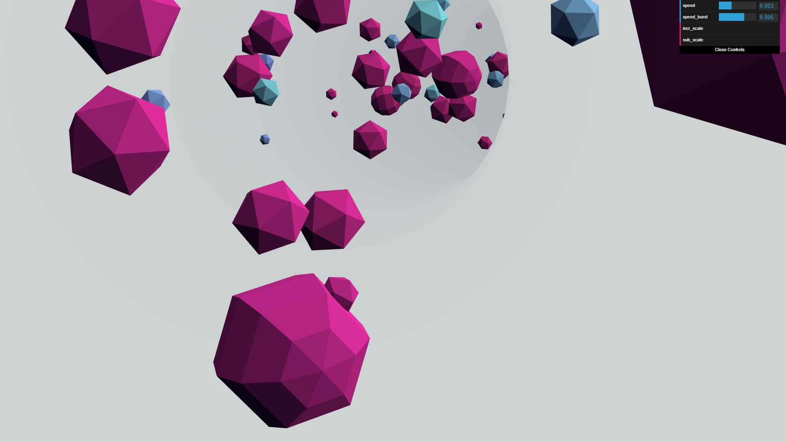

# Info-805-TP3
BLANC Swan & LE BRAS Clément

## Particles-Tunnel

Ce programme a pour but de simuler un tunnel en 3D avec des particules qui circulent a l'intèrieur.

### Contrôles

- Déplacer la souris pour faire bouger la vision du tunel
- Clic (gauche ou droit) pour faire apparaître une vague de particule

### Panneau de commande

Fichier `particles-tunnel.html`

- Speed: Vitesse des particules lorsque l'on ne clique pas
- Speed_burst: Vitesse des particules lorsque l'on clique
- incr_scale: Incrémenter la taille des particules
- sub_scale: Désincrémenter la taille des particules

Enjoy
